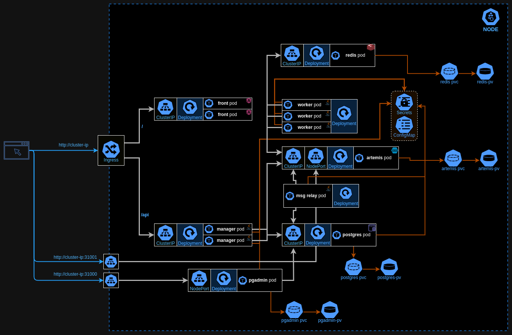

# Fibonacci on k8s


## Running on microk8s

0. The microk8s was installed using snap
```
$ snap info microk8s
$ sudo snap install microk8s --classic --channel=1.30/stable
$ sudo usermod -a -G microk8s $USER
```

1. Start microk8s
```
$ mickrok8s start
```

2. We need to enable several addons
```
$ microk8s enable ingress
$ microk8s enable storage
$ microk8s enable dns
$ microk8s enable host-access
```

3. Deploy all objects located in `fib` directory to k8s cluster ()
```
$ microk8s kubectl apply -f fib/
```

Then verify all pods status in `fibonacci` namespace:
```
$ microk8s kubectl -n fibonacci get pods
NAME                        READY   STATUS      RESTARTS        AGE
artemis-57d94b6ccd-w8k2v    1/1     Running     0               12m
db-init-job-8qsg2           0/1     Completed   0               12m
front-575dcb58b6-kzkzh      1/1     Running     0               12m
front-575dcb58b6-q828j      1/1     Running     0               12m
manager-5dd5b645c4-nlxrx    1/1     Running     1 (11m ago)     12m
manager-5dd5b645c4-z9t47    1/1     Running     0               12m
pgadmin-677cf49c8b-r55bj    1/1     Running     0               12m
postgres-84fdfbd988-fhp2l   1/1     Running     0               12m
redis-f74cb74d5-hc8wh       1/1     Running     0               12m
worker-557d8569b7-qdhh6     1/1     Running     3 (8m7s ago)    12m
worker-557d8569b7-tx4q9     1/1     Running     3 (8m28s ago)   12m
worker-557d8569b7-xsdqz     1/1     Running     4 (2m58s ago)   12m

```

4. Now the services are available on cluster ip, e.g:

- [http://10.0.0.1](http://10.0.0.1) - the Fibonacci app
- [http://10.0.0.1:31000](http://10.0.0.1:31000) - the PG admin portal (user: postgres@postgres.dev, password: postgres)
- [http://10.0.0.1:31001](http://10.0.0.1:31001) - the Artemis console (user: artemis, password:artemis)

## Running on minikube

1. Start minikube
```
$ minikube start
```

2. Be sure the INGRESS support is enable
```
$ minikube addons enable ingress
```

3. Deploy all objects located in `fib` directory to k8s cluster ()
```
$ kubectl apply -f fib/
```

Then verify all pods status in `fibonacci` namespace:
```
$ kubectl -n fibonacci get pods
NAME                        READY   STATUS      RESTARTS        AGE
artemis-57d94b6ccd-w8k2v    1/1     Running     0               12m
db-init-job-8qsg2           0/1     Completed   0               12m
front-575dcb58b6-kzkzh      1/1     Running     0               12m
front-575dcb58b6-q828j      1/1     Running     0               12m
manager-5dd5b645c4-nlxrx    1/1     Running     1 (11m ago)     12m
manager-5dd5b645c4-z9t47    1/1     Running     0               12m
pgadmin-677cf49c8b-r55bj    1/1     Running     0               12m
postgres-84fdfbd988-fhp2l   1/1     Running     0               12m
redis-f74cb74d5-hc8wh       1/1     Running     0               12m
worker-557d8569b7-qdhh6     1/1     Running     3 (8m7s ago)    12m
worker-557d8569b7-tx4q9     1/1     Running     3 (8m28s ago)   12m
worker-557d8569b7-xsdqz     1/1     Running     4 (2m58s ago)   12m
```

4. Now the services are available on cluster ip, e.g:
```
$ minikube ip
192.168.70.2
```
- `http://192.168.70.2` - the Fibonacci app
- `http://192.168.70.2:31000` - the PG admin portal (user: postgres, password: qwerty)
- `http://192.168.70.2:31001` - the Artemis console (user: artemis, password:artemis)